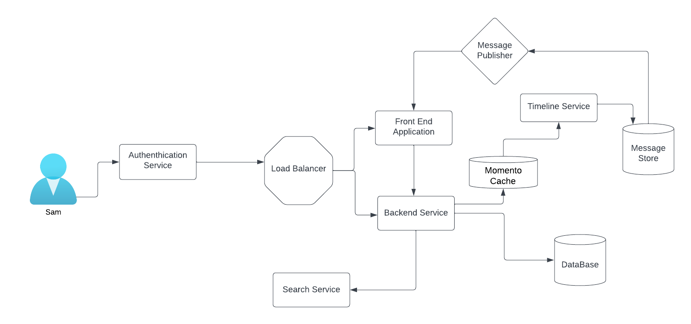

# Week 0 — Billing and Architecture
This week Summary
•	Watched all the video sessions, including the sessions from Ashish and Chriag,entire was really good and helpful.
•	Completed the conceptual and logical diagrams using Lucid chart.
•	Created an Admin user and set the required permission
•	Used Gitpod and configured AWS CLI to set up the workspace.Also created a budget and an alarm using AWS CLI

## Conceptual  Diagram  

