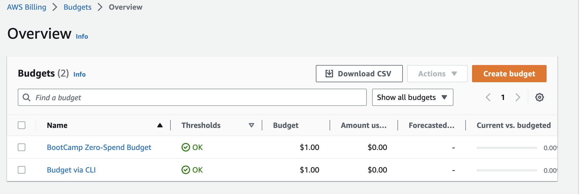
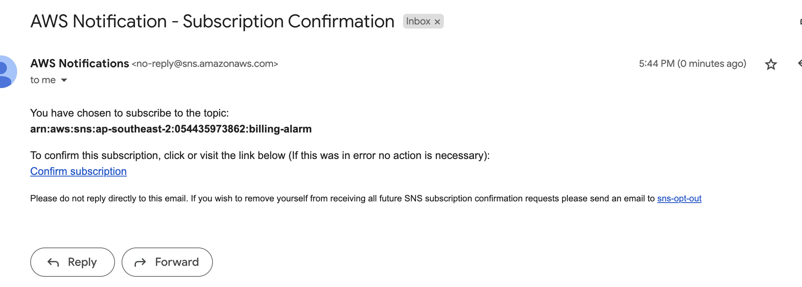
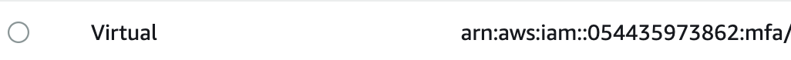

# Week 0 — Billing and Architecture
## Summary
- Watched all the video sessions, including the sessions from Ashish and Chriag,entire was really good and helpful.
- Completed the conceptual and logical diagrams using Lucid chart.
- Created an Admin user and set the required permission
- Used Gitpod and configured AWS CLI to set up the workspace.Also created a budget and an alarm using AWS CLI

## Conceptual  Diagram  

Lucid Chart Link -  https://lucid.app/lucidchart/1bf430b6-b8b2-417f-8420-0eabeb091a07/edit?viewport_loc=269%2C149%2C1549%2C748%2C0_0&invitationId=inv_02f7a70e-97ca-4518-abea-1aefbfd3796e

## Logical  Diagram  

Lucid Chart Link -  https://lucid.app/lucidchart/d849cfe6-5f73-4683-bac2-02cb1b35688d/edit?viewport_loc=24%2C195%2C1549%2C748%2C0_0&invitationId=inv_43bdc7fe-7b02-428e-a95b-5bb78b55d8bd

## Gitpod
Used gitpod and configured to download awscli every time a new workspace is setup.Used gpenv to save AWS creditinals in gitpod

## AWS Budget 
Created aws budget using console first and later used  AWS cli from gitpod to create second budget

## SNS Topic and AWS Alaram
Created sns topic and AWS Alaram using gitpod

##  Enabled MFA for root user 

