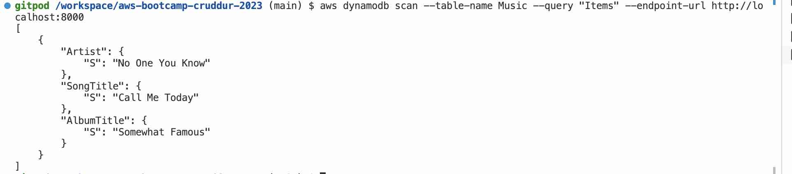

# Week 1 — App Containerization
## Summary
-Watched all the video sessions.
- Containerized frontend and backend apps.
- Created a Docker Compose file and included DynamoDB and PostgreSQL.
- Updated API spec using OpenAPI specification.
- Created notification endpoint the backend and connected it to the frontend.
- Verified the application locally and in Gitpod to ensure the new API is working correctly.
- Worked with the BusyBox container.

## Docker and Docker-Compose running locally 

Below is screenshot of Docker containers running lically including dynamoDb and postgres

## Runnning Front End locally

## Verification of Notification API using postman

## Verification of Notification API using postman

## Verified Postgres connection

## Verified Dynamo DB in GitPod 

## Verified Dynamo DB in GitPod 

## Verified using Gitpod UI

